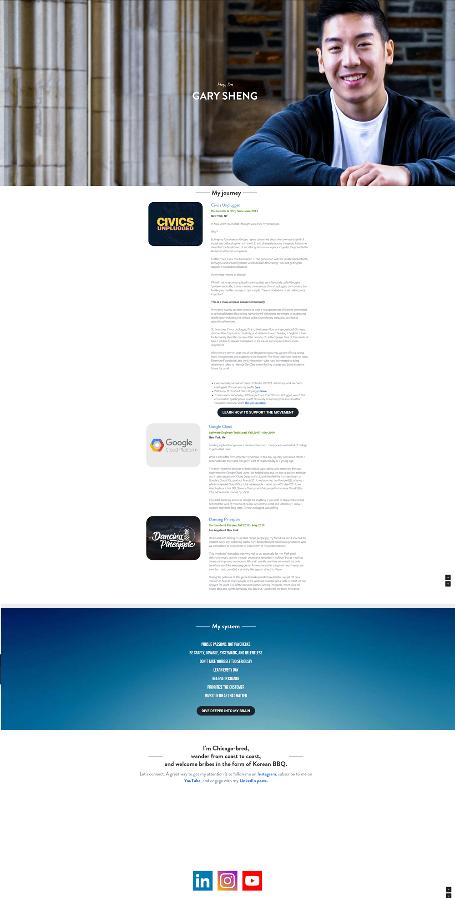

# Project 1: Design Journey

**For each milestone, complete only the sections that are labeled with that milestone.**

Be clear and concise in your writing. Bullets points are encouraged.

**Everything, including images, must be visible in Markdown Preview.** If it's not visible in Markdown Preview, then we won't grade it. We won't give you partial credit either. This is your warning.

## Personal Website Design Exploration (Milestone 1)

Identify three personal websites that exist today on the web. Include a screenshot of the home page for each site. **We'll refer to these are your "example websites."**

1. <https://angelahe.dev/>

    

2. <https://marinalinofficial.com/>

    

3. <http://www.garysheng.com/>

    

### Personal Website 1 Review (Milestone 1)

> Review the personal website you identified above. (1 paragraph)
> Who do you think this site is designed for? Who is its intended target audience?
> What do you like about the design?
> What could be improved about the design?

I think the website is designed for recruiters and those who are interested in Angela He's work and what she is involved in I really like the simple navigation header what includes her home page and the works she's been involved in. She has groups her page links according to their topic. The ones on the left are about her works, particularly her involvement in VR, Web  Design, Game Design and Writing for blogs. On the right is more business involved and prospective as they have links to her shop and her resume for recruiters. Finally on the bottom right hand side of her website's home page, she has links to where she can be contacted. Her home page works as an "About me" because it describes who she is, where she studies, what she studies, the works she's done and where she can be found online.

I really liked how compact and simplistic design it for the amount of information it has the potential to offer.

 In terms of what can be improved, her site is a little hard to load just because of the amount of gifs and animations that is on it, especially when you scroll down to her work. I would've like it if I had control over what types of gifs play, when they play, so that I don't get overloaded by the amount of animations.

### Personal Website 2 Review (Milestone 1)
> Review the personal website you identified above. (1 paragraph)
> Who do you think this site is designed for? Who is its intended target audience?
> What do you like about the design?
> What could be improved about the design?

The site is also designed for people are in interested in Marina's work. In particular she is a songwriter and singer, so that is why she has a display page with her an her guitar as the "hero" image, in order to gain people's attention. Afterword, she provides information about her latest song - anxiety attack. She also provides links for where her music can be found such as spotify and apple and youtube. I believe she groups her information quite well as each "page" per say is dedicated to a specific topic, where it be her latest work, or her merchandise or where her music can be listened to.

Finally at the bottom she has several links with simplistic descriptions or icons that it obvious where they lead to.

One thing that I do not like about her website is that on the text on the hero image of her home page is very hard to see. If I hadn't been looking for a navigation bar, I wouldn't have spotted the text that says home, about, music or shop. So one thing I would like to change is to make the text on the navigation bar a darker color.

### Personal Website 3 Review (Milestone 1)
> Review the personal website you identified above. (1 paragraph)
> Who do you think this site is designed for? Who is its intended target audience?
> What do you like about the design?
> What could be improved about the design?

I think Gary Sheng's site is for those who want to learn more about the work or projects he's been involved in as a large section of his page is about "his journey". He words his links as if those who are visiting his site want to learn more about him for example - "dive into my brain". Finally he explicitly asks people to connect with him with his ending section - "Let's Connect" and several links where you can connect. His intended audience are those who are interested in him. I like his simple hero image which is of himself and the text at the top that introduces him in a simple way - I am Gary Sheng. I personally believe he has too much information on his home page and I wish he split it up into different web pages.

## Personal Site & Audience (Milestone 1)

### Website Topic (Milestone 1)
> Briefly explain what your website will be about. Share your vision of your personal website.

My website will be about myself, in particular my personal drawings, interests and projects I'm involved in

### Audience (Milestone 1)
> Briefly explain who the intended audience(s) is for your website. Be specific and justify why this audience is appropriate for your site's topic.

The intended audience for my website are those who are interested in art and design and the projects I am involved in. I think this audience is appropriate because my website is going to be about me, include photos of my art and my designs and thus my audience should be interested those topics and about me in order to find my own personal website.

## Content Planning (Milestone 1)

Plan your site's content.

### Example Websites Content Review (Milestone 1)
> For each of your 3 example websites, identify the content on each site.
> List each piece of content for each site using a summary of the content.

Example Site 1:
- Introductory art hero image
- Description with name, college, major, interests of study
- Links to personal social media
- Link to resume
- Link to shop
- Collection of projects and gifs that briefly show what the project is about.

Example Site 2:
- Hero image with her and a guitar
- Aesthetic image of her latest song
- Description of her merchandise and link to shop
- Links to where her music can be found.
- Footer with social media links
- Music
- Navigation links

Example Site 3:
- Hero image of Subject
- Text including name
- Information that is similar to resume
  - Companies he has been involved in
  - Long description of job
- Information page of his passions and personality
- Links to social media and where he can be found
  - Instagram, youtube, LinkedIN, etc

### Your Site's Planned Content (Milestone 1)
> List the content you plan to include your personal website.

- Hero page of a photo of myself or my art (a drawing?)
- Text about my self
  - My name, my college, what I study
- Links to my previous projects and/or experiences
  - Even if they are just placeholders

- Links to social media, LinkedIn and Handshake.
- Link to Shop

### Content Justification (Milestone 1)
> Explain (about a paragraph) why this content is the right content for your site's intended audience.

My site's intended audience are people who want to find out more about me. Thus, it is important to put an image of what I look like or what I create. It is important that I have examples of my work, and where I can be contacted in case my audience would like to speak with me.

### Home Page Content (Milestone 1)
> Briefly identify what content you will include on the homepage and why this content should be the first thing your target audience sees when they visit your site.

On my homepage, I think the first think my audience should see is a welcoming and open statement about myself. I want to give of a friendly air and good first impression. I want to convey the type of person I am and what I enjoy at first glance. This is important because my audience is seeking to find out more about me and I should seem friendly so that they are interested in scrolling down my webpage to find out more. If I do not have a good impression they will not want to learn more. I would also want my home page to be pretty simple with not too many words and let colors and images draw them in.

## Information Architecture (Milestone 2)

### Content Organization (Milestone 2)
> Document your iterations of card sorting here.
> Include photographic evidence of each iteration of card sorting and description of your thought process for each iteration.

 

 In this card sort example I ended up grouping my contact into 3 pages: Art and Designs, Home and About. In Art and Designs I put examples of my Art called Art #1 and art #2, links to my art social media as a well as my etsy shop which sells stickers. I decided to group these together because they were all related to drawing and mostly focused on where one can find my art. In the 2nd page, my Home page, I displayed a photo of me and my logo as well as a navigation bar and a footer which leads to other pages. Ideally these links would also appear on my other pages as well to travel between the pages. Finally on my about page, I put a paragraph of information about me, as well as picture of my cat for fun and contact information- my email and phone number so that anyone interested in speaking with me could find me :>

 

 In my second card sort I organized my pages into a home page, a contact page and a about me page. In my home page I decided to put my logo but also examples of my art, so that the first thing viewers see would be my designs. There is also my navigation and footer which I think should belong on all pages. In my about me page, I put an image of myself and a paragraph describing me, my shop and my social media so that after reading the paragraph about me, they can go to my shop and my social media. Finally my contact page is very brief, with information about my phone and my email and a picture of my cat as a fun bonus.

### Final Content Organization (Milestone 2)
> Which iteration of card sorting will you use for your website?

For my website I will used the first card sorting because I would like a page just dedicated to displaying my art, my social media and my etsy shop. My about me page will contain my contact inforamtion instead of my social media, making it seem more personal and real.

> Explain how the final organization of content is appropriate for your site's audiences.

The organization of my content is appropriate for my audience, who are people interested in my art and my designs because there is a page that is clearly labeled "Art and Designs", making it extremely easy for my audience to find what they are looking for. I will make my Home Page welcoming and simple so that those who visit my website will want to stay and easily find what they want to find. Those who want to learn more about me and also check out an About Me page, and since this website for those who like my art, they might be interested to learn who I am outside of it.

### Navigation (Milestone 2)
> Please list the pages you will include in your personal website navigation.

- Art and Designs
- Home
- About
- Shop

> Explain why the names of these pages make sense for your site's audience.

The homepage makes sense because on this page, users can easily navigate between the web pages with simple buttons. As I explained before, an About page might be interesting to my audience who want to find out who I am outside of my drawings, and since the whole purpose of my website is to display my art and my projects, having a page that is clearly labeled Art and Designs makes it clear to my audience how to find my work. Also I really liked that there was a shop link on my website inspirations so I decided to include one as well!

## Visual Themes (Milestone 3)

**Make the case for your decisions using concepts from class, as well as other design principles, theories, examples, and cases from outside of class.**

Remember to focus on the things we can't see just by looking at the site: changes, alternatives considered, processes, and justifications.

Each section is probably around 1 reasonably sized paragraph (2-4 sentences).

### Theme Ideas (Milestone 3)
> Discuss several (more than two) ideas about styling your site's theme. Explain why the theme ideas are appropriate for your target audiences.

For my site, I would like to use a cool green so that my website ellict calming feelings from my audience when they come to visit. I will also add a sprinkle of  pinks and yellows from my art and gradient backgrounds so that it gives off a warm and welcoming feeling that makes visitors want to stay. Since it is a personal site, I decided to make a "logo", which is my name with a rigid looking font - Georgia.

I also want the navigation to have easily read text that is well contrasted so that my audience have no trouble navigating my website. My site also has some images of my art, which I plan on making them have rounded corners so they look more softer and appealing to the audience.

These themes are appropriate for my target audience because those who visit my site want to have no trouble navigating about it (good contrast) and should feel welcomed (soft corners and warm colors) when they visit in order to have interest in learning more about me or my art. Since it is a personal site, it should also contain a logo to indicate professionalism.

### Final Themes (Milestone 3)
> Which two themes did you select as your final candidates? Why?

My final theme is the one I have described above, and focuses on being warm, welcoming and easy to read. This is because  I want those who visit my site to have no trouble navigating it, and I also want them to feel welcome on my personal site through the choice of colors.

### Theme Design (Milestone 3)
> Discuss your 2 final theme designs: how did you come to them, what are their strengths and weaknesses, how do they fit your overall design goals and audiences?

My themes' strength is that it's colorful, and well contrasted. However, it might not seem very professional because of the many colors: pink, black, green, yellow that I plan on adding to the site as well as the colors on my art. My audience would most likely appreciate a site that they can easily read and understand, so focusing on contrast is ideal. I want my site to be warm and welcoming and the use of warm and calming colors (yellows/pinks and green) fits with that goal.

> Emotion is a big part of design. What emotions where you thinking about or trying to convey in your designs?

I want to convey warmness and friendliness, as well as a welcoming air that makes my audience excited and interested to explore the rest of my site. It also shouldn't be very difficult for visitors to navigate it in order to learn more about me, thus I included a navigation bar with links that have a large font size, and a footer they will hopefully have an easy time navigating my website and feel content when moving to different pages.

## Layout & Composition (Final Submission)

### Home Page Layout (Final Submission)
> Include several sketches of possible layout ideas for the home page.
> Provide an explanation for each sketch explaining the idea.
> Show your design process.

####Sketches: Home Page

I knew I definitely wanted an image of myself on my home page since this is considered a personal website and what could be more personal than an image of myself?  I thought about having a hero image with a brief introduction of myself on top of the image. Since I wanted my site to seem welcoming, I added rounded corners to the image instead of rigid corners. Though it can't easily be seen from this sketch, the hero image was meant to be centered as well, with me in the center, so the first thing the users see is an image of myself.

I also considered having my social media icons on the top right corner, in the navigation bar for easy access.

I solidfied the idea of a footer, with clickable email and linkedIn icons so visitors could reach me if they really wanted to. I got the idea of repeating the main navigation in the footer and including a section that is specifically for Contacting since it seems to be a common standard in company websites.

In this layout I decided that instead of icons, I would include my name on the top right cornell of the navigation bar.

I thought about a two column layout where my image is on the left side and information about myself is ot the right. I quickly scrapped that idea because I realized that I could simply write that information in the About Me page. As always, I have a standard footer.

For my final site layout, I decided that - if my hero image were to be placed in the center, then maybe it would make more sense if my Logo was placed in the center as well. Thus, this layout has my navigation links - Home, About, Art and Design and Shop split on the left and right sides of my logo which is in the center.

I decided to but the information about myself in a box so that everything is grouped together and easier to read because text is not always well contrasted over an image unless the background is simplistic (which, in my hero image it is not). I also decided to include a Learn More button that links directly to my About page for easy navigation! As always there is a standard footer.
### Final Site Layout (Final Submission)
> Include a sketch of the final layout for each page in your site.
> Provide an explanation below each sketch.

####Home Page

This home page is the same as the one I linked above. It includes a centered logo and centered hero image because that is what the user will likely see first. It also includes a learn more button for easy navigation after reading a brief introduction about me ( my name and major ). It also includes a footer since it's pretty standard across all sites.

####About Page

I decided to split the content on this page into two columns - the left including a picture of my cat as a cute addition to the page, and the right side about my Journey as an artist and designer! As always there is a standard footer and navigation that is the same across all pages.

####Art and Design Page

For my Art and Design Page, I kept my navigation and footers consistent. In terms of content, I created a header informing visitors that this page contains my Art and Designs. There is a divider seperating the text from my art pieces, which have round corners to seem more inviting. Below the images is a short description of either the art or a link to let visitors see more if interested.

## Rationale (Final Submission)

**This rationale should be polished writing: one you might submit as a report to a client or boss to help explain the project and convince them you did a good job. You'll be surprised how much writing and communicating you need to do about projects and choices on internships and jobs; practice that here.**

It should be a comprehensive, complete story of the project. You might find that each section runs a few paragraphs (1-2). Sketches can often help tell the story of your design. Screenshots are also useful for describing issues discovered during the design process and how you addressed them.

**All images must be visible in Markdown Preview for credit!**

Your rationale should be a polished version of the earlier explanations.

### Audience (Final Submission)
> A complete and polished description of the intended audience(s) for your website.

The audience for my personal website, are users who want to learn more about who I am as a person and/or who are interested in my art and my designs.

### Design Goals (Final Submission)
> An explanation of the design goals for that audience, based on your earlier rationales.

For such an audience, I want my site primarly reach two goals:
  - 1. Be easy to navigate
  - 2. Be warm and inviting

If my website accomplishes these two goals, then my audience will most likely be encouraged to stay on the site and explore, thus leading to opportunities where they contact me, visit my sticker shop or my art instagram. A user who visits my site does so because they are curious about who I am and what I do. It is my goal to keep take their intial interest and expand it. They should not leave confused.

Thus, I focus on the readability of my website, implementing common design practices, and using colors and images so my site's theme is one that is warm and inviting.

### Content Organization & Navigation (Final Submission)
> An explanation of how the final content organization and navigation met your goals and why its appropriate for your audience(s).

My final content organization and navigation met my goals through the following implementations:

- By using white text on a dark background, and a large font size, my pages' content was easy to read and links were easy to read.
- I included a "Learn More" button my home page so that users could be brought to the next page - "About", right away without needing to search for the link in my navigation bar.
- I included common design patterns that I saw across several websites such as a navigation bar and a footer that contact links so that users were comfortable on my site and knew where to look if they needed assistance.

- In my home page I placed the brief introduction of myself on the left side of the hero image because english text is typically read from left to right. This placement is exactly what my audience expects.

- Likewise, text is also read from top to bottom and the placement of a header on the top of the page and paragraphs or captions following it below the header also agrees with the audience's expectations.

### Visual Design (Final Submission)
> An explanation of how the final design met your goals and why its appropriate for your audience(s).

One of my goals for my site was that it would ellict warm and comforting emotions from my site's audience. I achieved my goal through the use of the following:

- The imagery of a smile on my home page should ellict feelings of happiness from my vistors.
- My site's main color is green, which acts as a reminder of nature, which often inducing feelings of stillness and peace to those experiencing it. It also pairs well with my hero image, which is myself in nature setting to imply feelings of calmness that my audience might feel in nature.
- There are small accents of warm colors - such as the pink and yellow in the images of my art and gradient background. These warm colors might act to comfort my audience further and make them feel happy when viewing my art and website pages.

### Self-Reflection (Final Submission)
> What did you learn from this assignment? What are some of your strengths and weaknesses?

From this assignment I learned how to ultize markdown and how to choose colors that fit with the images and dividers I was planning to include in my website site. I learned about the Color Picker tool in atom and it took me a few tries to get a color that worked well as a background to my images. I learned a lot about css and how to select a specific element, either with classes, or spaces between elements or ids. It was also my first time making a footer, and I learned how to use flexbox and margin so that each of the footer sections - the icons, contact section and navigation section was well organized.

 My strength is that I think I have a good eye for color and tend instinctively know when a color pairs well with another.  I think my weakness might be font choice - I do not know which fonts would make a website look professional and what would not.
